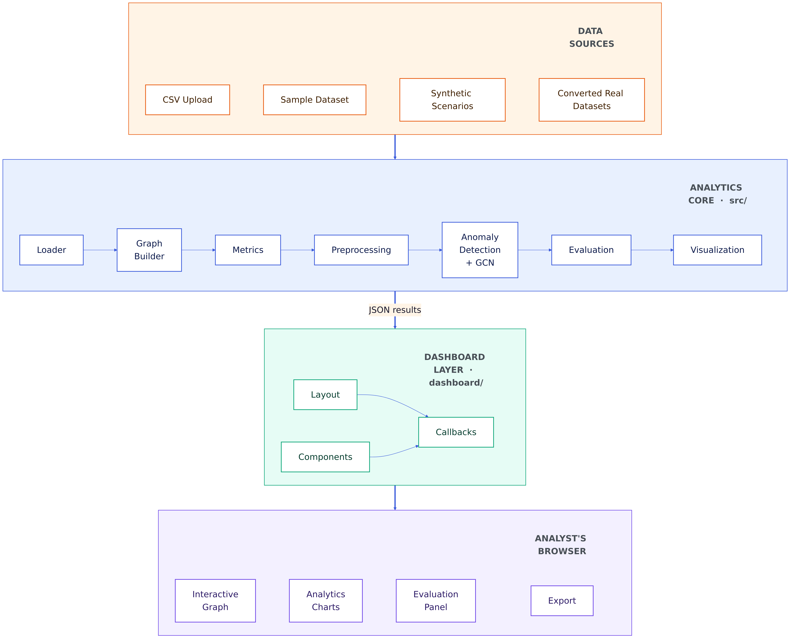
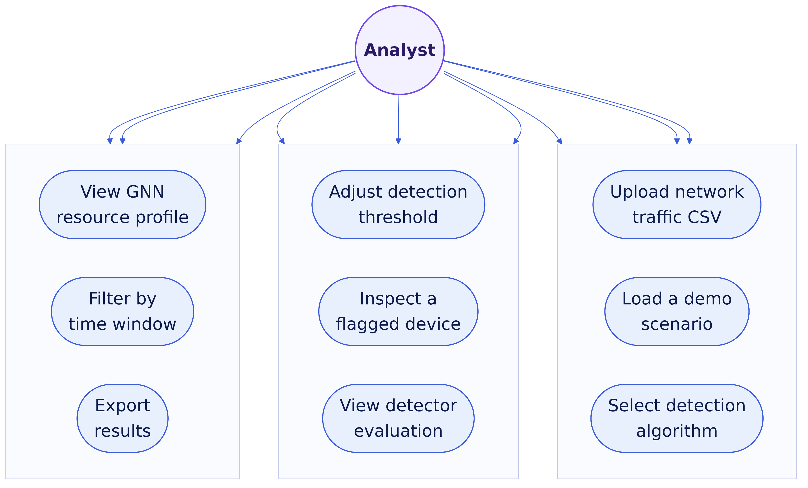
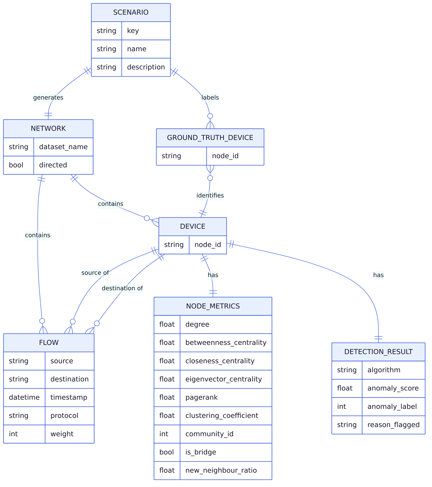
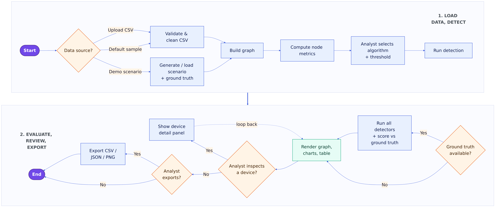
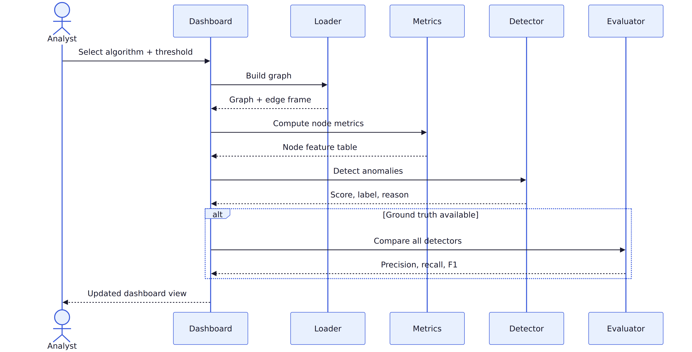
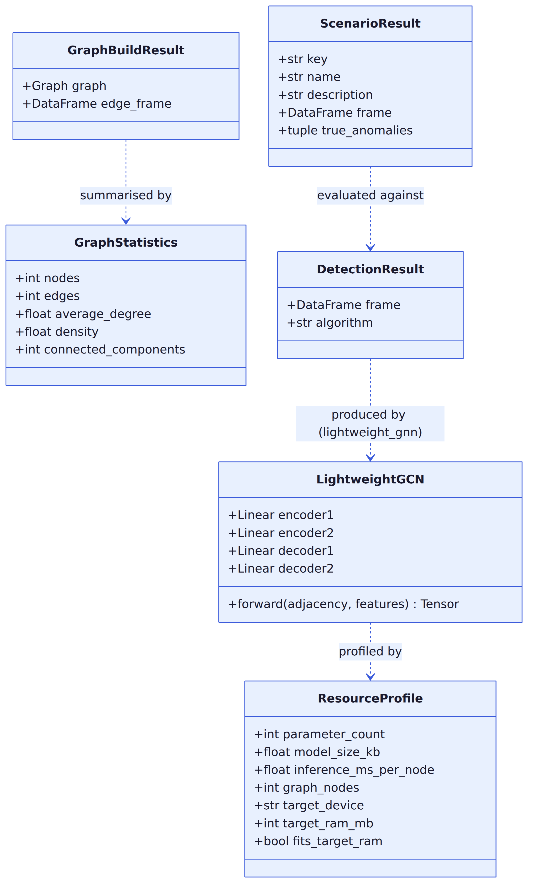

# CHAPTER THREE
## METHODOLOGY AND SYSTEM DESIGN

This chapter explains how the research and system development were carried out. It states the research approach and data collection methods used, translates the objectives of Chapter One into concrete functional and non-functional requirements, documents the tools and technologies selected and why, presents the system's architecture and design through a set of standard diagrams, describes the detection algorithms in full including the lightweight GCN autoencoder at the centre of this work, details the datasets used and how they were prepared, sets out how the system was tested and how its detection accuracy was validated, and closes with the ethical considerations relevant to a project built entirely on real network traffic captures.

---

### 3.1 Research Methodology

#### 3.1.1 Research Approach

This research follows a **Design Science Research** approach. Design Science is appropriate here because the project's central contribution is a working artefact — a lightweight graph neural network detector integrated into a full anomaly-detection pipeline — rather than a hypothesis tested through survey or interview data. The methodology proceeds through the standard Design Science cycle: problem identification and motivation (Chapter One), definition of objectives (Chapter One), design and development of the artefact (this chapter and Chapter Four), demonstration of the artefact on real data, and evaluation of the artefact against measurable criteria (precision, recall, F1-score, and resource footprint).

An **experimental component** sits inside this Design Science cycle: every detector built for this system — the rule-based detector, three classical machine learning detectors, a consensus ensemble, and the lightweight GCN autoencoder — is run under identical, controlled conditions (the same graph, the same node features, the same detection threshold) and scored against known ground truth. This controlled, repeatable comparison is what allows Chapter Four to report which detector performs best under which conditions, rather than relying on a single model's self-reported accuracy.

#### 3.1.2 Data Collection Methods

This project does not collect data from human participants; no questionnaire or interview instrument was used, as the research question concerns the behaviour of algorithms on network traffic, not human opinion or experience. Data collection is entirely **dataset-based**, drawn from three sources:

1. **Real, labelled public research datasets** — a scenario from the IoT-23 dataset (Stratosphere Laboratory, Czech Technical University), containing genuine traffic from an infected IoT device, and a scenario from the related CTU-13 dataset (Garcia et al., 2014), containing genuine botnet traffic from a university network. Both datasets are labelled flow-by-flow by their original researchers, which provides the ground truth against which detection accuracy is measured.

2. **Synthetically generated, seeded scenario data** — a set of controlled attack scenarios (a network scanner, a data-exfiltration hub, a rogue bridge device, and a coordinated botnet) generated programmatically for this project. Because the anomalous devices in these scenarios are injected by the generator itself, their identity is known with certainty, which makes them useful for validating that a detector behaves correctly before it is trusted on real data.

3. **A small hand-constructed sample dataset**, used as the system's default dataset for first-run demonstration and for the unit test suite, where minimal, exactly-known graphs are required.

#### 3.1.3 System Development Methodology

The system was developed **iteratively**, in the style of Agile software development, rather than through a single up-front Waterfall design. Each capability — graph construction, node metrics, the rule-based detector, the classical machine-learning detectors, the consensus ensemble, the scenario generator, the evaluation framework, the dashboard, and finally the lightweight GCN detector — was built as a self-contained increment, exercised immediately with automated tests and a running instance of the dashboard, and only then followed by the next increment. This produced several concrete design corrections during development that a Waterfall process would have deferred to a late integration phase: for example, the discovery that the dashboard's node colouring initially used fixed anomaly-score cut-offs rather than the active detection threshold was found and corrected through this continuous verify-as-you-build cycle, as was the discovery that the Local Outlier Factor detector's neighbour count needed adjusting for graphs containing many structurally identical nodes. Every increment ends with the full automated test suite passing and the dashboard verified to boot and respond correctly before the next increment begins, which is the defining discipline of this development methodology.

---

### 3.2 Requirements Analysis

#### 3.2.1 Functional Requirements

The system shall:

1. Accept network traffic data as a CSV file containing `source`, `destination`, `timestamp`, and `protocol` columns, or accept one of the system's built-in demonstration datasets.
2. Validate uploaded data, rejecting files with missing required columns, no valid rows after cleaning, or more devices than the system's rendering budget permits, with a clear error message in each case.
3. Construct a directed or undirected graph from the traffic data, aggregating repeated communications between the same pair of devices into a single weighted edge.
4. Compute, for every device (node) in the graph: degree, degree centrality, betweenness centrality, closeness centrality, eigenvector centrality, PageRank, clustering coefficient, connected-component membership and size, community membership, bridge-edge involvement, and a temporal "new neighbour ratio" describing how much of a device's contact list is new within the most recent portion of the capture.
5. Detect anomalous devices using a selectable algorithm: a rule-based detector, Isolation Forest, Local Outlier Factor, One-Class SVM, a consensus ensemble of the previous four, or a lightweight graph convolutional network autoencoder.
6. Allow the user to adjust the detection threshold and see the anomaly count, the highlighted graph, and the anomalous-devices table update accordingly.
7. Generate synthetic attack scenarios with known ground truth on demand, and separately, auto-discover any converted real dataset placed alongside a ground-truth sidecar file.
8. When ground truth is available for the active dataset, evaluate every detector against it and report true positives, false positives, false negatives, precision, recall, and F1-score for each.
9. Report the lightweight GCN detector's resource footprint — parameter count, model size, and per-node inference latency — assessed against the published memory specification of a representative resource-constrained device.
10. Render the network graph interactively, colouring devices by anomaly severity or by detected community, highlighting bridge edges and newly-appeared edges, and allowing the user to pan, zoom, fit the view, and expand the graph to fill the screen.
11. Allow the user to select a device (by clicking the graph, selecting a table row, or searching by name) and view its full metric breakdown, its neighbours, its anomaly score, why it was flagged, and — where ground truth exists — whether it is a genuine injected or labelled anomaly.
12. Display five analytics charts summarising the graph: degree distribution, centrality distribution, anomaly-score histogram, top-degree devices, and protocol distribution.
13. Restrict the graph to a user-selected percentage window of the capture's time span and recompute everything accordingly.
14. Export the current anomaly results as CSV or JSON, and the current graph view as a PNG image.

#### 3.2.2 Non-Functional Requirements

- **Performance:** the system must remain interactively responsive for graphs of up to 750 devices, the limit enforced on uploaded data; graphs used for evaluation in this project are held to a stricter 320-device budget to keep rendering, betweenness-centrality computation, and GCN training comfortably fast (detection completes in well under a second for the datasets used in Chapter Four).
- **Usability:** the interface follows a security-operations-centre dashboard convention — a dark, high-contrast theme, colour-coded severity (blue/amber/red), and a persistent legend — so that a device's status is readable at a glance without consulting documentation.
- **Portability:** the system must run identically via a local Python virtual environment or via Docker Compose, on Linux, macOS, or Windows; a Makefile and an equivalent Windows batch script expose the same set of setup, run, test, and dataset-conversion commands on every platform.
- **Reliability:** malformed input must produce a readable error message rather than a crash; every random process in the system (community detection, the classical detectors' internal randomness, the scenario generator, and the GCN's weight initialisation and training) is seeded so that results are reproducible from run to run.
- **Maintainability:** the analytics core (graph construction, metrics, detection, evaluation) is kept free of any dependency on the dashboard framework, so it can be tested, reasoned about, and reused independently of the user interface; each module has a corresponding automated test file.
- **Privacy:** the system performs all processing locally; no network traffic data, uploaded file, or detection result is transmitted to any external server at any point.
- **Reproducibility:** every dataset conversion, scenario generation, and detection run is deterministic given the same input and the same random seed, which is a precondition for the accuracy figures reported in Chapter Four to be independently verifiable.

#### 3.2.3 User Requirements / User Stories

- As a security analyst, I want to upload my own network traffic CSV so that I can check my own network for anomalous devices.
- As a security analyst, I want to compare several detection algorithms on the same data so that I can judge which one is most trustworthy for my traffic before I rely on it.
- As a security analyst, I want to adjust the detection threshold and see the effect immediately, so that I can trade off missed detections against false alarms to suit my situation.
- As a project presenter, I want built-in demonstration scenarios with known, verifiable ground truth, so that I can show a detector working correctly rather than merely running.
- As a project presenter, I want a measured comparison of detector accuracy on real, independently-labelled traffic, so that my claims about detection performance are evidence-based rather than asserted.
- As a user investigating a flagged device, I want to click it and see exactly why it was flagged and who it talks to, so that I can judge whether the alert is worth acting on.
- As a user producing a report, I want to export the current results as CSV, JSON, or an image, so that I can include them in other documents.
- As a developer extending the system, I want a documented contract for what a new detector, dataset, or metric must provide, so that I can add one without having to read the entire codebase first.

---

### 3.3 Tools and Technologies Used

#### 3.3.1 Programming Language

**Python 3.13** was used throughout, for both the analytics core and the lightweight GCN implementation. Python was chosen because its data-science ecosystem (pandas, NumPy, NetworkX, scikit-learn, PyTorch) covers every layer this project needed — graph construction, classical machine learning, and deep learning — without switching languages, and because it is the language in which the great majority of the anomaly-detection and GNN literature reviewed in Chapter Two publishes its own reference implementations.

#### 3.3.2 Frameworks and Libraries

| Library | Role in the system |
|---|---|
| Dash, Dash Bootstrap Components, Dash Cytoscape | The web dashboard framework, its UI component library, and its interactive network-graph rendering component |
| Plotly | The five analytics charts and the exportable static network figure |
| NetworkX | Graph construction and every graph-theoretic metric (centralities, clustering, bridges, connected components, Louvain community detection) |
| pandas, NumPy | Tabular data handling and numerical computation throughout the pipeline |
| scikit-learn | The three classical machine-learning detectors (Isolation Forest, Local Outlier Factor, One-Class SVM), feature scaling, and score normalisation |
| SciPy | Statistical helper functions used during development experimentation (e.g. rank-based score comparison) |
| PyTorch (CPU build) | The lightweight GCN autoencoder — implemented directly in PyTorch's tensor and autograd API rather than a graph-specific library, so that the only dependency is a standard, widely-available deep learning framework |
| Kaleido | Static image export for the PNG download feature |
| pytest | The automated test suite |

PyTorch Geometric and similar graph-specific deep learning libraries were deliberately not used; a two-layer graph convolutional network reduces to a small number of matrix multiplications, which is straightforward to implement directly against PyTorch's core tensor operations, keeping the system's dependency footprint to a single general-purpose deep learning library.

#### 3.3.3 Database / Data Storage

This system does not use a persistent relational or NoSQL database management system. It is a single-user, local analytical tool in which each session's working data — the loaded graph, its computed metrics, the current detection results, and the active ground truth — exists only for the duration of that session, held in the browser as client-side Dash `Store` components and serialised as JSON between the browser and the Python server. Input datasets and their ground-truth labels are stored as flat files: CSV for traffic records and a JSON "sidecar" file for ground truth, discovered automatically at start-up. This design was a deliberate choice rather than an omission: a persistent database would add operational complexity (a schema, a connection, a migration path) without benefiting a tool whose purpose is stateless, repeatable analysis of one dataset at a time; Section 3.4.3 nonetheless presents the system's logical data model in entity-relationship form, since that model governs how the flat files and in-memory structures relate to one another regardless of how they are physically stored.

#### 3.3.4 Development Tools

- **Git**, for version control, with the working history organised as a sequence of focused, independently-testable commits.
- **A Makefile**, and an equivalent Windows batch script (`make.bat`) exposing identical commands, for environment setup, running the dashboard, running the test suite, and converting real datasets.
- **Docker and Docker Compose**, for a containerised alternative to the local Python environment.
- **pytest**, run continuously during development as the acceptance gate for every increment described in Section 3.1.3.
- A standard code editor with Python language support was used for implementation; no IDE-specific feature was relied upon, so the project is editor-agnostic.

---

### 3.4 System Design

#### 3.4.1 System Architecture

The system is organised into two strictly separated layers: an analytics core with no dependency on the web framework, and a dashboard layer that depends on the core but never the reverse. This separation means every detection algorithm, every graph metric, and every dataset converter can be tested and run without a browser. Within the analytics core, control flows through six stages for every dataset loaded: validation and cleaning (`loader`), graph construction (`graph_builder`), feature computation (`metrics`), feature scaling for the machine-learning detectors (`preprocessing`), anomaly detection (`anomaly_detection`, which delegates to `gnn` for the lightweight GCN), and finally scoring against ground truth where available (`evaluation`) and rendering (`visualization`). The dashboard layer's callbacks orchestrate this pipeline in response to user actions but contain no analytical logic of their own.



*Figure 3.1: Layered system architecture, showing the flow from data sources through the analytics core and dashboard layer to the analyst's browser.*

#### 3.4.2 Use Case Diagram

The single primary actor is the analyst using the dashboard in a browser; there is no secondary or administrative actor, consistent with the system's single-user design described in Section 3.3.3. Three of these use cases have a dependency on another: "Upload network traffic CSV" and "Load a demo scenario" both include an underlying data-validation step; "Select detection algorithm" and "Adjust detection threshold" both trigger the detection pipeline; and "View detector evaluation" and "View GNN resource profile" both require ground truth to be available for the currently active dataset before they can run.



*Figure 3.2: Use case diagram for the analyst interacting with the dashboard.*

#### 3.4.3 Database Design (Logical Data Model)

Although the system has no physical database (Section 3.3.3), its data is governed by the following logical entity-relationship model, which is realised as flat files and in-memory tables rather than as database tables. `DEVICE` and `FLOW` are the raw entities parsed directly from a CSV; `NODE_METRICS` and `DETECTION_RESULT` are derived entities computed by the analytics core for every device on every run; `SCENARIO` and `GROUND_TRUTH_DEVICE` exist only when a demonstration scenario or a converted real dataset with a ground-truth sidecar is active.



*Figure 3.3: Logical entity-relationship diagram of the system's data model.*

#### 3.4.4 Activity Diagram

The diagram wraps across two rows to fit the page: read the top row ("1. Load Data, Detect") left to right, then the bottom row ("2. Evaluate, Review, Export") right to left, continuing from where the top row ends. Every decision point is labelled with its outcomes (Yes/No) regardless of which direction that row reads, so the branch taken is unambiguous at each step.



*Figure 3.4: Activity diagram of a complete analysis session, from data source selection to export. Reads left-to-right on row 1, then right-to-left on row 2.*

#### 3.4.5 Sequence Diagram

The sequence below shows a single detection cycle initiated by the analyst — the core interaction the entire system is built around.



*Figure 3.5: Sequence diagram of one detection cycle, from algorithm selection to the updated dashboard view.*

#### 3.4.6 Class Diagram

The analytics core is written predominantly as small, immutable dataclasses passed between pure functions rather than as a deep class hierarchy; the diagram below reflects that structure, including the lightweight GCN's PyTorch module.



*Figure 3.6: Class diagram of the core dataclasses and the lightweight GCN model.*

---

### 3.5 Algorithm / Model Description

#### 3.5.1 Graph Construction Algorithm

```
Algorithm: BUILD_GRAPH(traffic_records, directed)
Input:  a cleaned table of (source, destination, timestamp, protocol) rows
Output: a graph G with weighted edges

1. Create an empty graph G (directed if `directed` is true, else undirected)
2. For each row (s, d, t, p) in traffic_records, in order:
3.     Add nodes s and d to G if not already present
4.     If edge (s, d) already exists in G:
5.         Increment its weight by 1
6.         Append t to its timestamp list and p to its protocol list
7.     Else:
8.         Add edge (s, d) to G with weight 1, timestamp list [t], protocol list [p]
9. Return G
```

This is a linear-time construction: each traffic record is visited exactly once, and repeated communication between the same two devices is folded into one weighted edge rather than a multigraph, which keeps every downstream graph-theoretic computation well-defined.

#### 3.5.2 Rule-Based Detection Algorithm

```
Algorithm: RULE_BASED_DETECT(features, threshold)
Input:  a table of per-node graph features; a detection threshold in [0, 1]
Output: an anomaly_score, anomaly_label, and reason_flagged for every node

1. degree_cut       ← mean(degree) + 1.5 × stdev(degree)
2. betweenness_cut  ← mean(betweenness) + 1.5 × stdev(betweenness)
3. new_neighbour_cut ← mean(new_neighbour_ratio) + stdev(new_neighbour_ratio)
4. bridge_clustering_cut ← median(clustering_coefficient)

5. For each node n:
6.     score(n) ← 0.35 × normalise(degree(n))
                + 0.35 × normalise(betweenness(n))
                + 0.15 × normalise(new_neighbour_ratio(n))
                + 0.15 × normalise(is_bridge(n))
7.     label(n) ← 1 if score(n) ≥ threshold else 0
8.     if label(n) = 1:
9.         reason(n) ← join the specific cut-offs n exceeds, e.g.
                       "Very high degree", "Very high betweenness",
                       "Too many new neighbours", "Isolated bridge"
10.    else:
11.        reason(n) ← "Within expected behavior"
12. Return score, label, reason for every node
```

Every threshold in this algorithm is derived from the statistics of the dataset it is run on (mean and standard deviation), rather than a fixed absolute number, so the same algorithm adapts to networks of different scale.

#### 3.5.3 Consensus Voting Algorithm

```
Algorithm: CONSENSUS_DETECT(features, threshold)
Input:  per-node graph features; a detection threshold
Output: a majority-vote anomaly_score, anomaly_label, and reason for every node

1. base_algorithms ← {rule_based, isolation_forest,
                       local_outlier_factor, one_class_svm}
2. For each algorithm A in base_algorithms:
3.     result_A ← DETECT(features, A, threshold)
4. For each node n:
5.     votes(n)   ← number of algorithms A for which result_A.label(n) = 1
6.     score(n)   ← mean over A of result_A.score(n)
7.     label(n)   ← 1 if votes(n) ≥ 2 else 0
8.     reason(n)  ← "Flagged by votes(n) of 4 detectors: " + names of
                     algorithms that flagged n, if label(n) = 1,
                     else "Within expected behavior"
9. Return score, label, reason for every node
```

Requiring at least two of the four independent detectors to agree is what distinguishes consensus from any single detector: a node flagged by only one method, which may be that method's own idiosyncratic false positive, is not enough to raise the consensus alarm.

#### 3.5.4 Lightweight Graph Convolutional Network Autoencoder

This is the central algorithmic contribution of the project. A standard Graph Convolutional Network layer transforms a matrix of node features `H` using the graph's symmetrically-normalised adjacency matrix `Â` and a learnable weight matrix `W`:

```
H' = activation(Â · H · W)
```

where `Â = D^(-1/2) (A + I) D^(-1/2)`, `A` is the graph's adjacency matrix, `I` is the identity matrix (giving every node a self-loop so its own features are never discarded), and `D` is the diagonal degree matrix of `A + I`. This single expression is the entire graph-specific computation the model needs; the remainder of the network is ordinary linear algebra, which is why it can be implemented directly in a general-purpose deep learning framework rather than a graph-specific library.

The model is a four-layer **autoencoder** — an encoder that compresses each node's feature vector down through the graph structure, and a decoder that reconstructs it back out:

```
Encoder:  10 input features → GCN layer → 8 hidden units → GCN layer → 4-unit bottleneck
Decoder:  4-unit bottleneck → GCN layer → 8 hidden units → GCN layer → 10 reconstructed features
```

This gives the model **224 trainable parameters** in total, small enough to state exactly and to hold, uncompressed, in under one kilobyte of memory.

```
Algorithm: TRAIN_AND_SCORE_GCN(features, graph)
Input:  per-node graph features; the graph's adjacency structure
Output: an anomaly_score for every node, and a resource profile for the model

1. X ← standard-scale(features)                       // mean 0, unit variance
2. Â ← symmetrically-normalised adjacency of graph
3. model ← LightweightGCN(input_dim = number of feature columns)
4. Repeat 150 times:
5.     X̂ ← model.forward(Â, X)                        // reconstruct features
6.     loss ← mean squared error(X̂, X)
7.     Update model's weights to reduce loss (Adam optimiser, learning rate 0.05)
8. X̂_final ← model.forward(Â, X)                      // final reconstruction
9. For each node n:
10.    raw_score(n) ← mean squared error(X̂_final(n), X(n))
11. anomaly_score ← min-max normalise(raw_score) into [0, 1]
12. profile ← count model parameters, measure model size in kilobytes,
               time repeated forward passes to obtain latency per node
13. Return anomaly_score, profile
```

Training is **unsupervised**: at no point does the algorithm see which nodes are truly anomalous. It is only ever asked to reconstruct each node's own features from its graph neighbourhood; a node whose position or features are structurally unusual is, by construction, harder for its neighbourhood to reconstruct, and its resulting reconstruction error becomes its anomaly score. This keeps the lightweight GCN's contract identical to every other detector in the system — it never trains on the ground truth it is later evaluated against in Chapter Four — and it is the reason the model can, in principle, be applied to a network for which no labelled attack examples exist at all.

---

### 3.6 Data Description / Dataset

#### 3.6.1 Source of Data

Three categories of dataset are used, described fully with their measured evaluation results in Chapter Four:

1. **IoT-23** (Stratosphere Laboratory, Czech Technical University) — real network traffic captured from IoT devices, including genuine malware infections, released publicly for security research. This project uses scenario 3-1, a horizontal port-scan capture from an infected device.
2. **CTU-13** (Garcia et al., 2014) — real botnet traffic captured on a university network, released publicly alongside flow-by-flow labels distinguishing normal, background, and botnet traffic. This project uses scenario 9, a Neris botnet capture.
3. A **synthetic scenario generator**, built for this project, which produces seeded, reproducible office-network traffic with one of four attack patterns injected: a network scanner, a data-exfiltration hub, a rogue bridge device, and a coordinated botnet.

#### 3.6.2 Size and Format

Both real datasets are supplied by their publishers in a flow-record format specific to the capture tool used (Argus `binetflow` for CTU-13; Zeek `conn.log.labeled` for IoT-23), each row representing one network flow with its source and destination address, timestamp, protocol, and a ground-truth label. Both are converted by a purpose-built script into this project's uniform CSV format — `source, destination, timestamp, protocol` — and a matching ground-truth sidecar file naming the labelled anomalous devices. Because both source captures span tens of thousands of hosts, each conversion samples down to a **320-device graph**, interleaving each anomalous device's own traffic round-robin so no single device's signature is lost to sampling, while preserving every benign/normal flow up to a fixed cap. This produces graphs of a size that remain interactively renderable and that keep betweenness-centrality computation and GCN training comfortably fast, while still containing every genuinely labelled anomalous device from the original capture.

#### 3.6.3 Preprocessing Steps

1. **Loading and validation** — confirm the required columns are present; parse timestamps and discard rows that fail to parse; strip whitespace and standardise protocol names to uppercase; remove duplicate rows and rows with missing endpoints.
2. **Graph construction** — aggregate repeated communications into weighted edges, as described in Section 3.5.1.
3. **Feature computation** — compute the full set of node-level graph metrics listed in Section 3.2.1, including the temporal new-neighbour ratio, which is computed by splitting the capture's time span into an earlier 75% and a later 25% and comparing each device's set of contacts across the two windows.
4. **Feature scaling** — for every detector except the rule-based detector, standardise the numeric feature columns to zero mean and unit variance, so that features with naturally larger numeric ranges (such as degree) do not dominate distance- or reconstruction-based scoring simply because of their scale.
5. **Ground-truth extraction** — for the real datasets, the anomalous devices are not asserted manually but extracted directly from the source capture's own per-flow labels (the devices that originate flows labelled malicious/botnet), so the ground truth used for evaluation in Chapter Four is exactly the label the original dataset's researchers assigned.

---

### 3.7 Validation and Testing Plan

#### 3.7.1 Testing Types

The system is tested at three levels:

- **Unit testing.** Every analytics-core module has a corresponding test file exercising it in isolation against small, hand-constructed graphs and feature tables, independent of the web dashboard. This covers input validation and cleaning, graph construction and edge weighting, metric computation, each detection algorithm (including a specific test that the consensus detector correctly accumulates votes, and a specific test confirming the GCN autoencoder's training function never receives the ground-truth labels it is later scored against), the scenario generator's determinism, and the evaluation module's precision/recall/F1 arithmetic.
- **Integration testing.** The running dashboard is exercised end-to-end by issuing the same HTTP requests the browser itself would issue against Dash's callback endpoints — loading a scenario, running a detector, and reading back the resulting graph, table, and evaluation panel — to confirm the analytics core and the dashboard layer are wired together correctly, not merely that each is individually correct.
- **User acceptance / demonstration testing.** The complete interactive workflow — loading each demonstration scenario, switching between detection algorithms, adjusting the threshold, inspecting flagged devices, and exporting results — is walked through manually in a browser before any feature is considered complete.

#### 3.7.2 Detection Accuracy Validation Methodology

Because this is an anomaly-detection system, correctness cannot be established by functional testing alone; a detector can run without error and still detect nothing meaningful. Detection accuracy is therefore validated by a dedicated methodology, distinct from the software tests above: every detector is run on identical features derived from the same graph, and its output is scored against ground truth using standard classification metrics —

- **Precision** = true positives ÷ (true positives + false positives)
- **Recall** = true positives ÷ (true positives + false negatives)
- **F1-score** = the harmonic mean of precision and recall

computed both on the synthetic scenarios, where the ground truth is exact by construction, and on the two real, independently-labelled datasets, where the ground truth was assigned by the original researchers rather than by this project. Measuring accuracy on data this project did not label itself is what allows the results in Chapter Four to be treated as evidence of detection performance rather than a demonstration tuned to succeed on its own test data.

---

### 3.8 Ethical Considerations

**Data privacy.** All network traffic used in this project originates from datasets that were collected, anonymised where necessary, and released for public research use by their original institutions (Stratosphere Laboratory at the Czech Technical University for IoT-23 and CTU-13). No traffic was captured from a live, identifiable individual or organisation by this project, and the system performs all processing locally, transmitting no uploaded data, dataset, or result to any external party.

**Consent.** This research does not involve human participants, and therefore required no informed-consent process of its own. The datasets used were collected and ethically released by their original researchers under terms permitting research use; this project's use of them is limited to that permitted research purpose, and their existing anonymisation and labelling are relied upon rather than altered.

**Security considerations.** The synthetic attack scenarios generated by this project are entirely fictitious, seeded data, generated for evaluation purposes and never directed at any real network or device. The real datasets used are historical captures of already-known, publicly documented malware behaviour, obtained only from their official public repositories; no new exploit, attack tool, or live network probing was developed or performed as part of this project. The system itself is a defensive and investigative tool — it flags candidate anomalies for human review, as stated in Chapter One, and produces no capability for launching an attack against any network.
