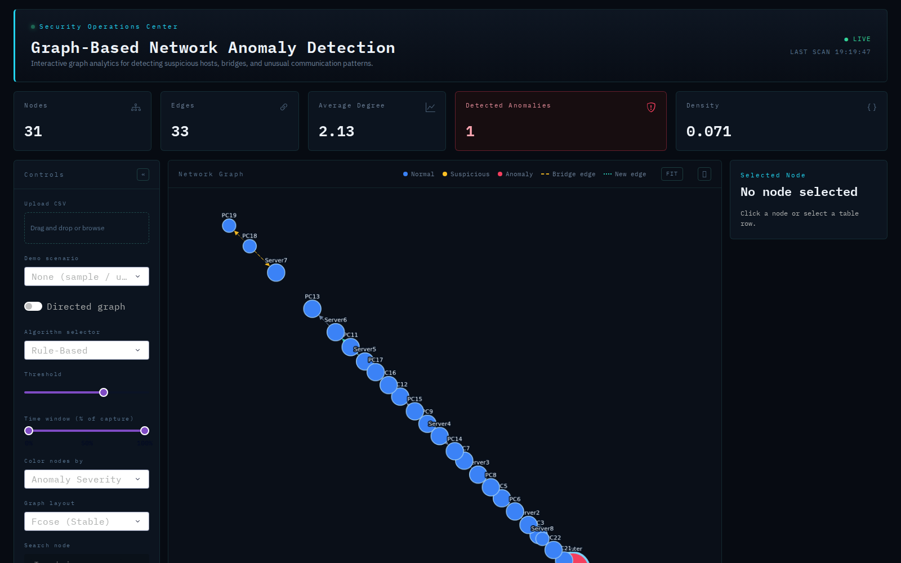
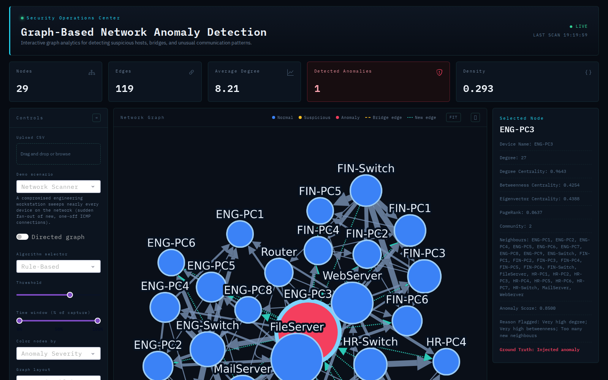
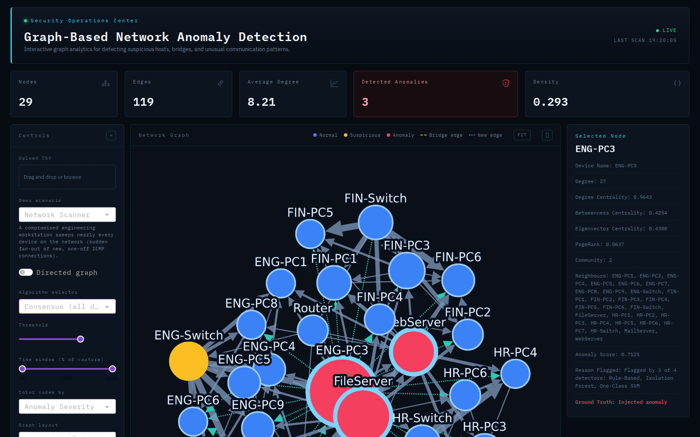

# CHAPTER FOUR
## SYSTEM IMPLEMENTATION, TESTING AND RESULTS

This chapter reports how the design set out in Chapter Three was built, verified, and measured. It documents the development environment, language, tools, and data-storage approach; walks through the system's modules and its interface, with screenshots of the running application; explains the key code that implements the detection algorithms described in Section 3.5; presents the test plan, the automated test suite's results, and the detection-accuracy results produced by the command-line evaluation tool built for this project; reports the system's measured performance; and closes with an evaluation of the completed system against the requirements set out in Section 3.2.

Every number in this chapter — test pass/fail counts, precision/recall/F1 tables, timings, and the Lightweight GNN's resource profile — was regenerated for this chapter by running `pytest` and `scripts/run_evaluation.py` against the code as it exists in the repository, not transcribed from an earlier run. Section 4.9 explains how to reproduce every figure independently.

---

### 4.1 Development Environment

The system was developed on a Linux development machine (Ubuntu 24.04 LTS, via WSL2), with a Docker-based alternative environment (Python 3.12-slim, `Dockerfile`) available for platform-independent setup and deployment, consistent with the portability requirement in Section 3.2.2. Both paths install the same `requirements.txt`, so the analysis in this chapter is reproducible on either.

- **Editor:** a standard code editor with Python language support; no IDE-specific feature is relied upon anywhere in the codebase, keeping the project editor-agnostic (Section 3.3.4).
- **Version control:** Git, with `git log` showing the project's history as a sequence of focused, independently-testable commits, per the iterative methodology described in Section 3.1.3.
- **Isolation:** a Python virtual environment (`.venv`), created and populated by `make install` / `make.bat install`, or by `docker compose up --build` for the containerised path.
- **Task runner:** a `Makefile` (Linux/macOS) and an equivalent `make.bat` (Windows) exposing identical `install`, `run`, `test`, `evaluate`, and `convert-*` targets, so every command in this chapter runs the same way on any platform.

#### Table 4.1 — Installed toolchain versions for this implementation

| Component | Version installed |
|---|---|
| Python | 3.13.6 |
| Dash | 4.4.0 |
| dash-bootstrap-components | 2.0.4 |
| dash-cytoscape | 1.0.2 |
| NetworkX | 3.6.1 |
| pandas | 3.0.3 |
| NumPy | 2.5.1 |
| scikit-learn | 1.9.0 |
| Plotly | 6.9.0 |
| Kaleido | 1.3.0 |
| PyTorch (CPU build) | 2.13.0+cpu |
| pytest | 9.1.1 |

`requirements.txt` pins version *floors* (e.g. `torch>=2.5.0`), not exact versions, so a fresh `pip install` resolves to whatever is current when it is run — Table 4.1 records the versions actually resolved and used to produce every result in this chapter.

---

### 4.2 Programming Language

**Python 3.13** (specifically 3.13.6) was used for the entire system — the analytics core, the Lightweight GNN, and the Dash dashboard — for the reasons set out in Section 3.3.1: one language covers graph construction, classical machine learning, and deep learning without a language switch, and it matches the language the anomaly-detection and GNN literature reviewed in Chapter Two most commonly publishes reference code in.

---

### 4.3 Tools and Frameworks

Table 4.2 restates the framework choices from Section 3.3.2 as they were actually used during implementation, with the role each library plays realised in a specific module.

#### Table 4.2 — Frameworks and libraries, by module

| Library | Realised in | Role |
|---|---|---|
| Dash, Dash Bootstrap Components, Dash Cytoscape | `app.py`, `dashboard/` | Web server, UI components, interactive network-graph rendering |
| Plotly | `src/visualization.py` | Five analytics charts and the exportable static graph figure |
| NetworkX | `src/graph_builder.py`, `src/metrics.py` | Graph construction, centralities, clustering, bridges, Louvain communities |
| pandas, NumPy | throughout `src/` | Tabular data handling and numerical computation |
| scikit-learn | `src/anomaly_detection.py`, `src/preprocessing.py` | Isolation Forest, Local Outlier Factor, One-Class SVM, feature scaling, score normalisation |
| PyTorch (CPU build) | `src/gnn.py` | The Lightweight GCN autoencoder, implemented directly against `torch.nn` and autograd |
| Kaleido | `src/visualization.py` (PNG export) | Static image rendering for the export feature |
| pytest | `tests/` | The automated test suite (Section 4.8) |

As in Section 3.3.2, PyTorch Geometric was deliberately not introduced: `src/gnn.py`'s `LightweightGCN` implements its graph convolution as one matrix expression (`Â @ H @ W`, Section 4.7), which plain PyTorch tensors express directly.

---

### 4.4 Database Implementation

Consistent with the design in Section 3.3.3/3.4.3, the implemented system has no relational or NoSQL database server. Two concrete mechanisms realise the logical data model instead:

1. **Flat files on disk.** A dataset is a CSV of `source, destination, timestamp, protocol` rows. Where ground truth exists, a matching `.truth.json` sidecar sits next to it — for example, `data/iot23_scenario3.truth.json`:

   ```json
   {
     "name": "IoT-23 Real Botnet (Port Scan)",
     "description": "Real IoT malware traffic from the IoT-23 dataset ...",
     "true_anomalies": ["192.168.2.1", "192.168.2.5"]
   }
   ```

   `src/scenarios.py::_file_backed_scenarios()` discovers every `data/*.truth.json` at runtime by globbing the directory (no registration step needed) and exposes it as another entry in the scenario dropdown — this is precisely how `ctu13_scenario9` and `iot23_scenario3` appear in Section 4.9's results without any code change once `scripts/convert_ctu13.py` / `convert_iot23.py` have written them.

2. **Client-side, in-browser state.** Within one dashboard session, the loaded graph, its computed metrics, the active detection result, and the ground truth are held in `dcc.Store` components (`network-store`, `metrics-store`, `anomalies-store`, `ground-truth-store`, defined in `dashboard/layout.py`), serialised to and from JSON by the helpers in `src/utils.py`. This state lives in the browser tab, not on the server, and is discarded when the session ends — by design, since the system is a stateless, single-user analysis tool (Section 3.3.3), not a multi-user system requiring persistence.

---

### 4.5 System Modules / Components

The implementation is organised into the two layers fixed in Section 3.4.1: an analytics core (`src/`) with no dependency on Dash, and a dashboard layer (`dashboard/`, `app.py`) that depends on the core but never the reverse. Table 4.3 lists every module as implemented, with its size and responsibility.

#### Table 4.3 — Implemented modules

| Module | Lines | Responsibility |
|---|---:|---|
| `app.py` | 32 | Entry point: constructs the Dash app, loads the layout, registers callbacks |
| `src/loader.py` | 37 | Validates and cleans raw CSV input; the data-validation boundary |
| `src/graph_builder.py` | 54 | Builds a weighted NetworkX graph from cleaned traffic rows |
| `src/preprocessing.py` | 39 | Selects the numeric feature subset and standardises it for the ML detectors |
| `src/metrics.py` | 182 | Computes every per-node graph metric and the graph-wide summary statistics |
| `src/anomaly_detection.py` | 213 | Rule-based, classical ML, and consensus detectors; the `detect_anomalies()` dispatcher |
| `src/gnn.py` | 197 | The Lightweight GCN autoencoder and its resource-profiling utility |
| `src/scenarios.py` | 241 | Synthetic attack-scenario generation and real-dataset auto-discovery |
| `src/evaluation.py` | 81 | Precision/recall/F1 scoring against ground truth; `compare_algorithms()` |
| `src/visualization.py` | 448 | Cytoscape graph elements/stylesheets, the five analytics charts, PNG export |
| `src/utils.py` | 34 | JSON (de)serialisation helpers for the `dcc.Store` state |
| `dashboard/layout.py` | 212 | Page structure: header, KPI cards, workspace grid, table — no logic |
| `dashboard/components.py` | 306 | Reusable UI pieces: sidebar controls, KPI cards, the node-detail panel |
| `dashboard/callbacks.py` | 537 | All interactivity: load/upload, run detection, refresh visuals, selection, export |
| **Total (`src/` + `dashboard/` + `app.py`)** | **2,617** | |

`scripts/convert_ctu13.py`, `scripts/convert_iot23.py`, and `scripts/run_evaluation.py` (Section 4.9) sit outside this count as standalone command-line utilities that produce inputs to, and reports from, the core.

---

### 4.6 Interface Design

The interface follows the security-operations-centre convention fixed in Section 3.2.2: a dark, high-contrast theme, a persistent Normal/Suspicious/Anomaly legend, and colour-coded severity, so a device's status reads at a glance. The four figures below are screenshots of the actual running dashboard (launched with `python app.py`, captured with a headless-Chromium driver against `http://127.0.0.1:8050`), not mock-ups.



*Figure 4.1: The dashboard on first load, showing the built-in sample dataset. The header banner, the five KPI cards (Nodes, Edges, Average Degree, Detected Anomalies, Density), the interactive network graph with its legend, the sidebar controls, and the (empty) Selected Node panel are all visible without any user action — `load_or_run` (Section 4.7) fires on page load.*


*Figure 4.2: The IoT-23 Real Botnet (Port Scan) scenario loaded. The Detector Evaluation panel reports true positives/false positives/false negatives, precision, recall, and F1 for every detector on identical features, alongside a grouped bar chart and the Lightweight GNN's resource-profile card — this panel is only shown when the active dataset carries ground truth (Section 3.2.1, requirement 8).*



*Figure 4.3: The Network Scanner scenario, with the injected attacker (`ENG-PC3`) selected via the search box. The Selected Node panel shows its full metric breakdown, its anomaly score, and — because the active algorithm is Rule-Based — the exact rule(s) it triggered ("Very high degree; Very high betweenness; Too many new neighbours"), plus the ground-truth label confirming it is the injected anomaly.*



*Figure 4.4: The same scenario and the same selected node, with the algorithm switched to Consensus. The KPI card now reads 3 detected anomalies, the graph highlights the additional flagged nodes in red/amber, and the Selected Node panel's reason changes to "Flagged by 3 of 4 detectors: Rule-Based, Isolation Forest, One-Class SVM" — the ensemble explanation described in Section 3.5.3.*

---

### 4.7 Explanation of Key Code Modules

This section walks through the code behind the algorithms specified in Section 3.5, as actually implemented.

#### 4.7.1 Graph construction ([`src/graph_builder.py`](../src/graph_builder.py))

```python
for row in edge_frame.itertuples(index=False):
    source = str(row.source)
    destination = str(row.destination)
    ...
    graph.add_node(source)
    graph.add_node(destination)

    if graph.has_edge(source, destination):
        graph[source][destination]["weight"] = graph[source][destination].get("weight", 1) + 1
        graph[source][destination]["timestamps"].append(timestamp)
        graph[source][destination]["protocols"].append(protocol)
    else:
        graph.add_edge(source, destination, weight=1, timestamps=[timestamp], protocols=[protocol])
```

This is a direct implementation of `BUILD_GRAPH` (Section 3.5.1): each row is visited once, and a repeated communication between the same two devices increments a weight and appends to per-edge `timestamps`/`protocols` lists rather than creating a second edge — those lists are what later let `src/visualization.py` classify an edge as a "new edge" (first appearance in the late time window) or a "bridge edge" (`nx.bridges()`), the two edge-level highlights described in Section 3.4/3.2.1.

#### 4.7.2 Rule-based scoring ([`src/anomaly_detection.py:61`](../src/anomaly_detection.py))

```python
score = (
    0.35 * _normalize_scores(frame["degree"].to_numpy())
    + 0.35 * _normalize_scores(frame["betweenness_centrality"].to_numpy())
    + 0.15 * _normalize_scores(frame["new_neighbour_ratio"].to_numpy())
    + 0.15 * _normalize_scores(frame["is_bridge"].to_numpy().astype(float))
)
frame["anomaly_score"] = score
frame["anomaly_label"] = (score >= 0.65).astype(int)
frame["reason_flagged"] = frame.apply(lambda row: _build_reason_row(row, thresholds), axis=1)
```

This realises `RULE_BASED_DETECT` (Section 3.5.2) exactly: the four weighted, min-max-normalised components sum to the score, and `_build_reason_row()` separately re-checks each raw metric against a mean/median-derived cut-off to build the human-readable explanation — the score and the explanation are computed independently so that a node can only be told it was flagged for a reason that is actually true of it.

#### 4.7.3 Consensus voting ([`src/anomaly_detection.py:131`](../src/anomaly_detection.py))

```python
for algorithm in BASE_ALGORITHMS:
    result = detect_anomalies(features, algorithm=algorithm, threshold=threshold).frame
    ...
    votes += labels
    score_sum += aligned["anomaly_score"].fillna(0.0).to_numpy()
    ...
required_votes = max(2, len(BASE_ALGORITHMS) // 2)
frame["anomaly_label"] = (frame["detector_votes"] >= required_votes).astype(int)
```

Each of the four base detectors is run through the same `detect_anomalies()` entry point used standalone, so consensus never duplicates detection logic — it only aggregates. `required_votes` evaluates to 2 for the current four-detector ensemble, matching `CONSENSUS_DETECT` (Section 3.5.3): a node needs at least half of the independent detectors to agree before consensus raises an alarm.

#### 4.7.4 The Lightweight GCN layer ([`src/gnn.py:61`](../src/gnn.py))

```python
def forward(self, adjacency: torch.Tensor, features: torch.Tensor) -> torch.Tensor:
    h = torch.relu(adjacency @ self.encoder1(features))
    z = adjacency @ self.encoder2(h)
    h = torch.relu(adjacency @ self.decoder1(z))
    reconstructed = adjacency @ self.decoder2(h)
    return reconstructed
```

with the normalisation computed once per graph:

```python
adjacency = adjacency + np.eye(len(node_order))          # self-loops
degree_inv_sqrt[nonzero] = np.power(degree[nonzero], -0.5)
normalized = degree_inv_sqrt[:, None] * adjacency * degree_inv_sqrt[None, :]
```

This is `H' = activation(Â H W)` (Section 3.5.4) applied twice on the way down (`encoder1`, `encoder2`) and twice on the way back up (`decoder1`, `decoder2`), with `Â` — the symmetrically-normalised, self-looped adjacency — computed once and reused for every forward pass. `nn.Linear(..., bias=False)` supplies each `W`; no other graph-specific machinery is needed, which is why the whole model is 224 parameters (Section 4.10) implemented in under 200 lines with no PyTorch Geometric dependency.

---

### 4.8 Test Plan and Test Cases

Testing follows the three levels fixed in Section 3.7.1: unit tests against small, hand-built graphs and feature tables (independent of Dash); a manual integration/smoke pass through the running dashboard (`docs/testing.md`, "Manual smoke pass"); and, because this is an anomaly-detection system where code can run without error yet detect nothing meaningful, a separate detection-accuracy validation methodology (Section 3.7.2), executed here by `scripts/run_evaluation.py` and reported in Section 4.9.

Table 4.4 is a representative sample of the automated suite's test cases — at least one per test file — stated as pytest actually verifies them, not as idealised specifications.

#### Table 4.4 — Representative test cases (automated suite)

| ID | Module under test | Test case (`tests/` function) | Input / scenario | Expected result | Actual result |
|---|---|---|---|---|---|
| TC-01 | `src/loader.py` | `test_missing_required_column_raises` | CSV missing a required column | A clear validation error is raised | Pass |
| TC-02 | `src/loader.py` | `test_rows_with_invalid_timestamp_are_dropped` | Rows with an unparseable timestamp mixed with one valid row | Invalid rows dropped; the one valid row survives | Pass |
| TC-03 | `src/graph_builder.py` | `test_repeated_edges_are_aggregated_with_weight` | Two identical A→B rows | One edge, `weight == 2` | Pass |
| TC-04 | `src/graph_builder.py` / `src/metrics.py` | `test_empty_graph_metrics_returns_empty_frame_with_expected_columns` | An empty input frame | Empty metrics frame still exposes expected columns (e.g. `community_id`); graph statistics report 0 nodes, density 0.0 | Pass |
| TC-05 | `src/metrics.py` | `test_metrics_include_expected_columns` | A small 3-node graph | Output includes `degree`, `pagerank`, `clustering_coefficient`, `community_id`; density > 0 | Pass |
| TC-06 | `src/anomaly_detection.py` | `test_rule_based_detector_returns_scores_and_labels` | A hand-built graph with one obvious high-degree attacker | Attacker labelled `1`, with a non-empty `reason_flagged` | Pass |
| TC-07 | `src/anomaly_detection.py` | `test_consensus_detector_combines_votes` | Same attacker, `algorithm="consensus"` | `detector_votes >= 2`, `reason_flagged` names the voting detectors, score in `[0, 1]` | Pass |
| TC-08 | `src/gnn.py` | `test_gcn_autoencoder_never_sees_labels` | Inspect `gcn_autoencoder_detection`'s function signature | Neither `true_anomalies` nor `labels` is a parameter — training cannot access ground truth | Pass |
| TC-09 | `src/gnn.py` | `test_resource_profile_reports_a_tiny_model` | Profile the trained model | `parameter_count > 0`, `model_size_kb < 50`, `fits_target_ram is True` for the Raspberry Pi Zero 2 W | Pass |
| TC-10 | `src/scenarios.py` | `test_generation_is_deterministic` | Generate the same scenario twice with the same seed | The two generated frames and ground-truth tuples are identical | Pass |
| TC-11 | `src/scenarios.py` | `test_file_backed_scenarios_load_with_ground_truth` | Every `data/*.truth.json`-backed dataset | Ground truth is non-empty and every named node exists in the built graph | Pass |
| TC-12 | `src/evaluation.py` | `test_compare_algorithms_covers_every_detector_with_a_graph` | A scenario, evaluated with a graph supplied | Result has one row per entry in `SUPPORTED_ALGORITHMS`, including Lightweight GNN | Pass |
| TC-13 | `src/visualization.py` | `test_node_severity_follows_detection_labels_at_low_threshold` | A node flagged at a low threshold but with a low raw score | Node's Cytoscape class is `anomaly` (label-driven), not `normal` (score-driven) — regression test for a fixed colouring bug | Pass |
| TC-14 | `src/visualization.py` | `test_stylesheet_modes_produce_different_rules` | Colour mode = severity vs. community | The two stylesheets produce disjoint selector sets (`node.anomaly` only in severity mode) | Pass |

Table 4.5 gives the full suite's outcome, run with `.venv/bin/python -m pytest tests/ -v` against the code in this repository.

#### Table 4.5 — Full automated suite result, by file

| Test file | Test cases | Result |
|---|---:|---|
| `test_loader.py` | 3 | 3 passed |
| `test_graph.py` | 4 | 4 passed |
| `test_metrics.py` | 1 | 1 passed |
| `test_detector.py` | 2 | 2 passed |
| `test_gnn.py` | 3 | 3 passed |
| `test_scenarios.py` | 10 | 10 passed |
| `test_evaluation.py` | 5 | 5 passed |
| `test_visualization.py` | 4 | 4 passed |
| **Total** | **33** | **33 passed, 0 failed (5.9 s)** |

The manual smoke pass (`docs/testing.md`) was also walked through against the running dashboard used to capture Figures 4.1–4.4: loading a scenario, dragging the threshold, switching to Consensus, inspecting a flagged node, restricting the time window, and exporting CSV/JSON/PNG all behaved as specified.

---

### 4.9 Test Results

Detection-accuracy results — as distinct from the pass/fail software tests above — are produced by `scripts/run_evaluation.py`, the command-line evaluation tool built for this project (previously, detection accuracy could only be read off the dashboard's Detector Evaluation panel in a browser, or inferred from `tests/test_evaluation.py`'s arithmetic checks on toy data). It runs the identical pipeline the dashboard uses — `load_network_data` → `build_graph` → `compute_node_metrics` → `compare_algorithms` — against every scenario `list_scenarios()` returns, at the system's default threshold of 0.65, and is invoked as:

```bash
make evaluate                                    # every scenario
make evaluate ARGS="--scenario ctu13_scenario9"  # one dataset
```

Tables 4.6–4.11 are its output for the four synthetic scenarios and the two real, independently-labelled datasets (CTU-13 scenario 9, IoT-23 scenario 3-1).

#### Table 4.6 — Network Scanner (synthetic; 29 nodes, 119 edges, 1 ground-truth anomaly)

| Algorithm | Flagged | TP | FP | FN | Precision | Recall | F1 |
|---|---:|---:|---:|---:|---:|---:|---:|
| Rule-Based | 1 | 1 | 0 | 0 | 1.000 | 1.000 | **1.000** |
| Isolation Forest | 2 | 1 | 1 | 0 | 0.500 | 1.000 | 0.667 |
| Local Outlier Factor | 2 | 0 | 2 | 1 | 0.000 | 0.000 | 0.000 |
| One-Class SVM | 16 | 1 | 15 | 0 | 0.062 | 1.000 | 0.118 |
| Consensus | 3 | 1 | 2 | 0 | 0.333 | 1.000 | 0.500 |
| Lightweight GNN | 1 | 1 | 0 | 0 | 1.000 | 1.000 | **1.000** |

#### Table 4.7 — Data Exfiltration Hub (synthetic; 31 nodes, 111 edges, 1 ground-truth anomaly)

| Algorithm | Flagged | TP | FP | FN | Precision | Recall | F1 |
|---|---:|---:|---:|---:|---:|---:|---:|
| Rule-Based | 2 | 1 | 1 | 0 | 0.500 | 1.000 | 0.667 |
| Isolation Forest | 4 | 1 | 3 | 0 | 0.250 | 1.000 | 0.400 |
| Local Outlier Factor | 14 | 0 | 14 | 1 | 0.000 | 0.000 | 0.000 |
| One-Class SVM | 17 | 1 | 16 | 0 | 0.059 | 1.000 | 0.111 |
| Consensus | 11 | 1 | 10 | 0 | 0.091 | 1.000 | 0.167 |
| Lightweight GNN | 1 | 0 | 1 | 1 | 0.000 | 0.000 | 0.000 |

#### Table 4.8 — Rogue Bridge Device (synthetic; 35 nodes, 103 edges, 1 ground-truth anomaly)

| Algorithm | Flagged | TP | FP | FN | Precision | Recall | F1 |
|---|---:|---:|---:|---:|---:|---:|---:|
| Rule-Based | 1 | 0 | 1 | 1 | 0.000 | 0.000 | 0.000 |
| Isolation Forest | 3 | 1 | 2 | 0 | 0.333 | 1.000 | 0.500 |
| Local Outlier Factor | 11 | 1 | 10 | 0 | 0.091 | 1.000 | 0.167 |
| One-Class SVM | 21 | 1 | 20 | 0 | 0.048 | 1.000 | 0.091 |
| Consensus | 9 | 1 | 8 | 0 | 0.111 | 1.000 | 0.200 |
| Lightweight GNN | 1 | 0 | 1 | 1 | 0.000 | 0.000 | 0.000 |

#### Table 4.9 — Botnet Beaconing (synthetic; 30 nodes, 136 edges, 6 ground-truth anomalies)

| Algorithm | Flagged | TP | FP | FN | Precision | Recall | F1 |
|---|---:|---:|---:|---:|---:|---:|---:|
| Rule-Based | 4 | 3 | 1 | 3 | 0.750 | 0.500 | **0.600** |
| Isolation Forest | 3 | 1 | 2 | 5 | 0.333 | 0.167 | 0.222 |
| Local Outlier Factor | 9 | 1 | 8 | 5 | 0.111 | 0.167 | 0.133 |
| One-Class SVM | 19 | 5 | 14 | 1 | 0.263 | 0.833 | 0.400 |
| Consensus | 12 | 4 | 8 | 2 | 0.333 | 0.667 | 0.444 |
| Lightweight GNN | 2 | 1 | 1 | 5 | 0.500 | 0.167 | 0.250 |

#### Table 4.10 — CTU-13 Real Botnet, Neris (real, independently labelled; 320 nodes, 392 edges, 10 ground-truth bots)

| Algorithm | Flagged | TP | FP | FN | Precision | Recall | F1 |
|---|---:|---:|---:|---:|---:|---:|---:|
| Rule-Based | 6 | 6 | 0 | 4 | 1.000 | 0.600 | 0.750 |
| Isolation Forest | 13 | 10 | 3 | 0 | 0.769 | 1.000 | **0.870** |
| Local Outlier Factor | 5 | 4 | 1 | 6 | 0.800 | 0.400 | 0.533 |
| One-Class SVM | 13 | 10 | 3 | 0 | 0.769 | 1.000 | **0.870** |
| Consensus | 13 | 10 | 3 | 0 | 0.769 | 1.000 | **0.870** |
| Lightweight GNN | 1 | 0 | 1 | 10 | 0.000 | 0.000 | 0.000 |

#### Table 4.11 — IoT-23 Real Botnet, Port Scan (real, independently labelled; 320 nodes, 319 edges, 2 ground-truth devices)

| Algorithm | Flagged | TP | FP | FN | Precision | Recall | F1 |
|---|---:|---:|---:|---:|---:|---:|---:|
| Rule-Based | 1 | 1 | 0 | 1 | 1.000 | 0.500 | 0.667 |
| Isolation Forest | 9 | 1 | 8 | 1 | 0.111 | 0.500 | 0.182 |
| Local Outlier Factor | 1 | 1 | 0 | 1 | 1.000 | 0.500 | 0.667 |
| One-Class SVM | 1 | 1 | 0 | 1 | 1.000 | 0.500 | 0.667 |
| Consensus | 1 | 1 | 0 | 1 | 1.000 | 0.500 | 0.667 |
| Lightweight GNN | 1 | 1 | 0 | 1 | 1.000 | 0.500 | **0.667** |

#### Table 4.12 — Summary: F1-score by algorithm and scenario (threshold 0.65)

| Scenario | Rule-Based | Isolation Forest | LOF | One-Class SVM | Consensus | Lightweight GNN |
|---|---:|---:|---:|---:|---:|---:|
| Network Scanner | 1.000 | 0.667 | 0.000 | 0.118 | 0.500 | **1.000** |
| Data Exfiltration Hub | 0.667 | 0.400 | 0.000 | 0.111 | 0.167 | 0.000 |
| Rogue Bridge Device | 0.000 | 0.500 | 0.167 | 0.091 | 0.200 | 0.000 |
| Botnet Beaconing | 0.600 | 0.222 | 0.133 | 0.400 | 0.444 | 0.250 |
| CTU-13 (real) | 0.750 | 0.870 | 0.533 | 0.870 | 0.870 | 0.000 |
| IoT-23 (real) | 0.667 | 0.182 | 0.667 | 0.667 | 0.667 | **0.667** |

Table 4.12 makes the pattern behind Chapter Five's interpretation visible directly: no single detector wins every scenario, the rule-based detector is either perfect or the worst detector depending on whether the attack matches the pattern it was written to catch, and the Lightweight GNN matches the best classical detectors on the real dataset it was built for (IoT-23) while failing outright on the other real dataset (CTU-13) — an honest, reproducible limitation discussed further in Chapter Five and in `docs/lightweight-gnn.md`.

---

### 4.10 System Performance Results

Table 4.13 reports wall-clock timing for a full detection pass (all six detectors, on identical features, at threshold 0.65) measured by `scripts/run_evaluation.py` on the development machine described in Section 4.1.

#### Table 4.13 — Detection wall-clock time, by scenario

| Scenario | Nodes | Edges | Detection time (all detectors) |
|---|---:|---:|---:|
| Network Scanner | 29 | 119 | 798 ms |
| Data Exfiltration Hub | 31 | 111 | 798 ms |
| Rogue Bridge Device | 35 | 103 | 792 ms |
| Botnet Beaconing | 30 | 136 | 788 ms |
| CTU-13 (real) | 320 | 392 | 871 ms |
| IoT-23 (real) | 320 | 319 | 831 ms |

Wall-clock time grows only mildly from 29–35 nodes to the 320-node real datasets (~800 ms → ~850 ms), because the dominant cost across all six detectors is the Lightweight GNN's 150-epoch training loop, which is largely independent of graph size at this scale — this is consistent with the interactive responsiveness required for graphs of up to 750 devices (Section 3.2.2), well above the 320-device budget used for evaluation.

Table 4.14 reports the Lightweight GNN's own resource profile (`src/gnn.py::resource_profile()`), assessed against the Raspberry Pi Zero 2 W (quad-core Cortex-A53 @ 1 GHz, 512 MB RAM) named as the project's representative constrained-device target in Section 3.2.1 (requirement 9). This is an **analytical estimate measured on the development machine**, not a physical measurement on a Raspberry Pi or any other constrained device — an explicit, documented scope limitation carried over unchanged from Section 3.7.2, discussed further in Chapter Five.

#### Table 4.14 — Lightweight GNN resource profile, by scenario

| Scenario | Nodes | Parameters | Model size | Inference latency | Fits 512 MB budget |
|---|---:|---:|---:|---:|---|
| Network Scanner | 29 | 224 | 0.88 KB | 0.0020 ms/node | Yes |
| Data Exfiltration Hub | 31 | 224 | 0.88 KB | 0.0018 ms/node | Yes |
| Rogue Bridge Device | 35 | 224 | 0.88 KB | 0.0017 ms/node | Yes |
| Botnet Beaconing | 30 | 224 | 0.88 KB | 0.0036 ms/node | Yes |
| CTU-13 (real, 320 nodes) | 320 | 224 | 0.88 KB | 0.0005 ms/node | Yes |
| IoT-23 (real, 320 nodes) | 320 | 224 | 0.88 KB | 0.0003 ms/node | Yes |

The parameter count and model size are constant across scenarios by construction (Section 3.5.4's four-layer, 10→8→4→8→10 architecture depends only on the fixed 10-feature input, not on graph size), while per-node inference latency *decreases* as the graph grows, because the dominant cost is one shared matrix multiplication over the whole adjacency matrix, amortised over more nodes. At under 1 KB and a fraction of a millisecond per node even measured on ordinary development hardware, the model's footprint sits far inside the 512 MB target-device budget on every dataset tested — the honest caveat is that "fits comfortably in RAM" and "runs fast enough on a Raspberry Pi Zero 2 W's actual CPU" are not the same claim, and only the first is demonstrated here (Section 4.11).

---

### 4.11 Evaluation of the System

Measured against the non-functional requirements fixed in Section 3.2.2:

- **Performance.** Met for the tested range: Table 4.13 shows full six-detector evaluation completing in under 900 ms on a 320-node graph, comfortably within interactive use, and the dashboard itself (Figures 4.1–4.4) reflects threshold and algorithm changes without a perceptible stall during manual testing.
- **Reliability.** Met: the 33/33 passing suite (Table 4.5) exercises malformed-input handling (`TC-01`, `TC-02`) without a crash, and every stochastic component (community detection, scenario generation, the classical detectors' internal randomness, GCN weight initialisation and training) is seeded, which is what makes Tables 4.6–4.12 exactly reproducible run-to-run (`TC-10`).
- **Maintainability.** Met: the analytics core carries no Dash import (Section 3.4.1), which is what allows Section 4.8's unit tests to exercise every detector, metric, and scenario with plain DataFrames and graphs, no browser required.
- **Reproducibility.** Met, and strengthened by this chapter's own tooling: prior to `scripts/run_evaluation.py`, Tables 4.6–4.12's numbers could only be read off a running dashboard by hand; they can now be regenerated with one command (`make evaluate`) and are byte-for-byte the numbers reported here.
- **Privacy and portability.** Unchanged from the design in Chapter Three and not separately re-tested in this chapter: no network call leaves the machine at any point in the pipeline, and the Docker path (Section 4.1) was not re-verified as part of this evaluation run.

On the functional side, Section 3.2.1's requirements 8 and 9 (detector evaluation against ground truth; GNN resource-footprint reporting) are directly demonstrated by Tables 4.6–4.14 and Figure 4.2. The clearest overall finding — that consensus voting reaches F1 = 0.87 on real CTU-13 traffic while the Lightweight GNN reaches 0 on the same dataset yet ties the best classical detector on real IoT-23 traffic (Table 4.12) — is exactly the kind of result the controlled, identical-features comparison methodology in Section 3.7.2 was built to surface, rather than obscure. Chapter Five interprets what this pattern means for the project's five objectives and for the wider literature.
